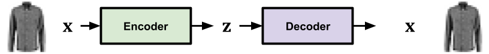
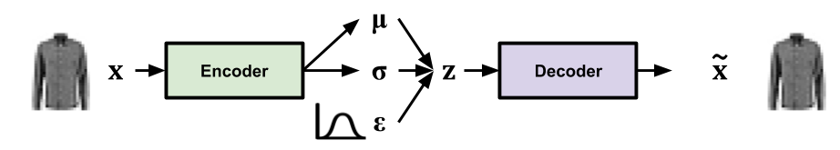
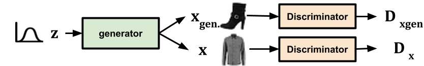
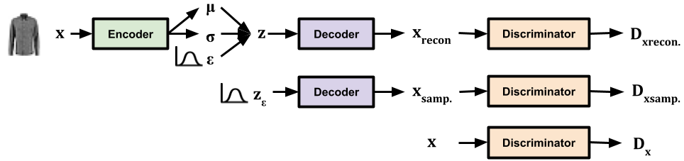
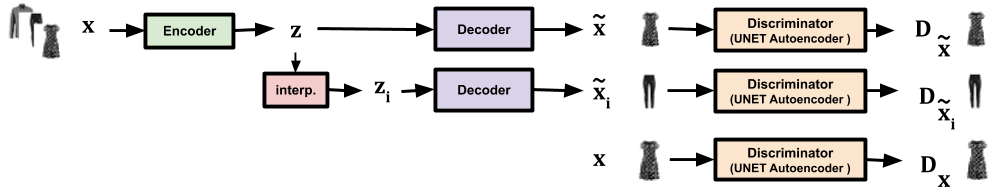
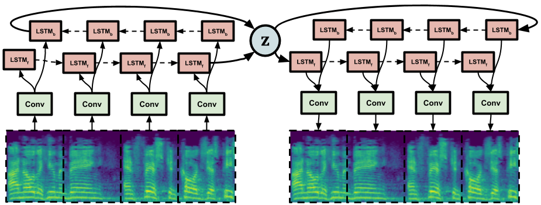
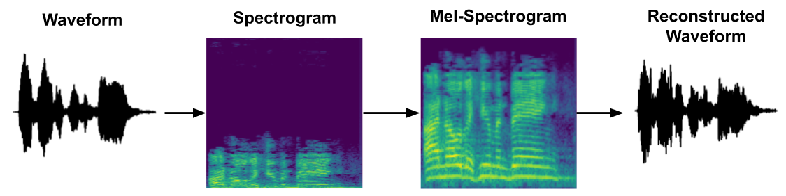
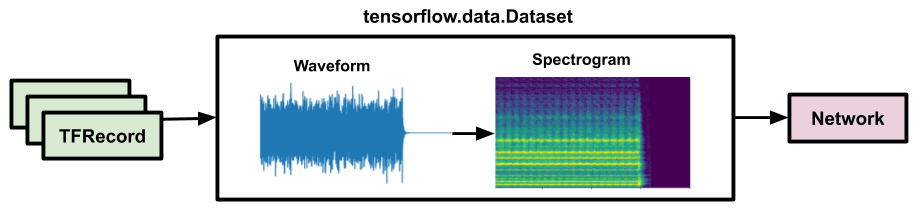

Generative models in Tensorflow 2
==============================

[Tim Sainburg](https://timsainburg.com/) (PhD Candidate, UCSD, Gentner Laboratory)

This is a small project to implement a number of generative models in Tensorflow 2. Layers and optimizers use Keras. The models are implemented for two datasets: [fashion MNIST](https://github.com/zalandoresearch/fashion-mnist), and [NSYNTH](https://magenta.tensorflow.org/datasets/nsynth). Networks were written with the goal of being as simple and consistent as possible while still being readable. Because each network is self contained within the notebook, they should be easily run in a colab session. 

## Included models:
### Autoencoder (AE) 

A simple autoencoder network.

### Variational Autoencoder (VAE) ([article](https://arxiv.org/abs/1312.6114)) 

The original variational autoencoder network,  using [tensorflow_probability](https://github.com/tensorflow/probability)

### Generative Adversarial Network (GAN) ([article](https://arxiv.org/abs/1406.2661)) 

GANs are a form of neural network in which two sub-networks (the encoder and decoder) are trained on opposing loss functions: an encoder that is trained to produce data which is indiscernable from the true data, and a decoder that is trained to discriminate between the data and generated data.

### Wasserstein GAN with Gradient Penalty (WGAN-GP) ([article](https://arxiv.org/abs/1701.07875)) 

WGAN-GP is a GAN that improves over the original loss function to improve training stability. 

### VAE-GAN ([article](https://arxiv.org/abs/1512.09300)) 

VAE-GAN combines the VAE and GAN to autoencode over a latent representation of data in the generator to improve over the pixelwise error function used in autoencoders. 

### Generative adversarial interpolative autoencoder (GAIA) ([article](https://arxiv.org/abs/1807.06650)) 

GAIA is an autoencoder trained to learn convex latent representations by adversarially training on interpolations in latent space projections of real data. 

## Other Notebooks:

### Seq2Seq Autoencoder (without attention) (Fasion MNIST:  | NSYNTH: )

Seq2Seq models use recurrent neural network cells (like LSTMs) to better capture sequential organization in data. This implementation uses Convolutional Layers as input to the LSTM cells, and a single Bidirectional LSTM layer. 

### Spectrogramming, Mel Scaling, MFCCs, and Inversion in Tensorflow 

Tensorflow has a signal processing package that allows us to generate spectrograms from waveforms as part of our dataset iterator, rather than pregenerating a second spectrogram dataset. This notebook can serve as a reference for how this is done. Spectrogram inversion is done using the Griffin-Lim algorithm. 

### Iterator for NSynth 

The NSYNTH dataset is a set of thousands of musical notes saved as waveforms. To input these into a Seq2Seq model as spectrograms, I wrote a small dataset class that converts to spectrogram in tensorflow (using the code from the spectrogramming notebook). 

